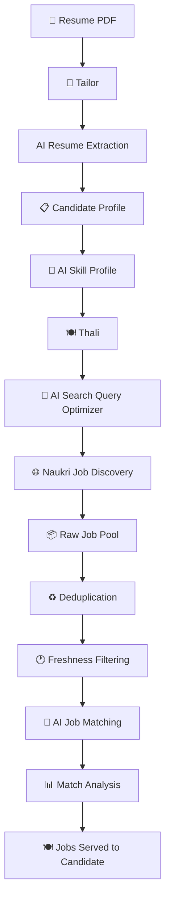
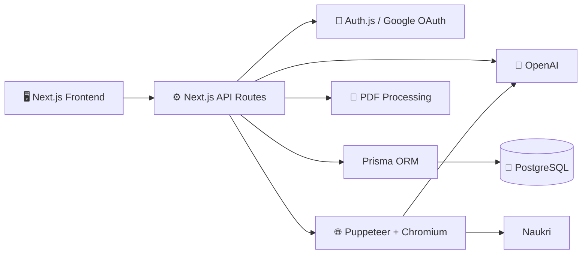

<div align="center">

# ✦ AVIORA

### AI-Powered Career Intelligence Platform

**Understand your career. Discover relevant opportunities. Find jobs made for you.**

<br />

<a href="https://aviora-silk.vercel.app/">

</a>
&nbsp;
<a href="https://github.com/Itzmeharsh/aviora">

</a>

<br />
<br />


<br />
<br />

# 🍽️ WE SERVE JOBS IN YOUR THALI

### Your resume goes in. Your career opportunities come out.

</div>

---

# 🌟 What is Aviora?

**Aviora** is an AI-powered career intelligence platform designed to transform a candidate's resume into actionable career opportunities.

Instead of treating a resume as a simple collection of keywords, Aviora understands the candidate's:

- 🧠 Skills
- 💼 Experience
- 🎓 Education
- 🚀 Projects
- 📜 Certifications
- 🛠️ Professional capabilities
- 🌍 Career background

Aviora then uses this information to discover relevant jobs and analyze how those jobs relate to the candidate's documented professional profile.

---

# 🧵 Tailor

## Your career profile, fitted to you.

**Tailor** is Aviora's profile intelligence layer.

It takes a candidate's resume and transforms it into a structured professional profile that can be used throughout the platform.

### Tailor's job

```text
                         📄 YOUR RESUME
                               │
                               ▼
                         ┌─────────────┐
                         │  🧵 TAILOR  │
                         └──────┬──────┘
                                │
               ┌────────────────┼────────────────┐
               │                │                │
               ▼                ▼                ▼
            🎓 Education     💼 Experience    🧠 Skills
               │                │                │
               └────────────────┼────────────────┘
                                │
                                ▼
                     📋 Professional Profile
                                │
                                ▼
                       🧠 AI Skill Profile
```

Tailor extracts and structures information such as:

- Personal information
- Professional summary
- Education
- Skills
- Work experience
- Internships
- Projects
- Certifications
- Achievements

---

# 🍽️ Thali

## Jobs served for you.

**Thali** is Aviora's job discovery and matching engine.

The idea is simple:

> **You shouldn't have to search endlessly for jobs. Your jobs should come to your Thali.**

```text
                         🍽️ THALI
                            │
                            │
                   "WE SERVE JOBS"
                            │
                            ▼
                 ┌──────────────────┐
                 │ Candidate Profile│
                 └─────────┬────────┘
                           │
                           ▼
                 ┌──────────────────┐
                 │ AI Skill Profile │
                 └─────────┬────────┘
                           │
                           ▼
                 ┌──────────────────┐
                 │ Search Optimizer │
                 └─────────┬────────┘
                           │
                           ▼
                 ┌──────────────────┐
                 │  Job Discovery   │
                 └─────────┬────────┘
                           │
                           ▼
                 ┌──────────────────┐
                 │   AI Matching    │
                 └─────────┬────────┘
                           │
                           ▼
                  ┌─────────────────┐
                  │  🍽️ YOUR THALI │
                  │                 │
                  │  Relevant Jobs  │
                  │  Match Details  │
                  │  Missing Skills │
                  └─────────────────┘
```

### Thali currently uses Naukri for job discovery.

The workflow is:

```text
📄 Resume
   │
   ▼
🧵 Candidate Understanding
   │
   ▼
🧠 AI Skill Profile
   │
   ▼
🔎 AI Search Query Generation
   │
   ▼
🌐 Naukri Job Discovery
   │
   ▼
♻️ Job Deduplication
   │
   ▼
🕐 Freshness Filtering
   │
   ▼
🎯 AI Job Matching
   │
   ▼
🍽️ Jobs in Your Thali
```

---

# 🧠 Aviora's Complete Intelligence Pipeline



---

# 🔥 How Aviora Works

## Step 1 — Upload Resume

The candidate uploads a resume in PDF format.

```text
📄 Resume
   │
   ▼
Aviora
```

---

## Step 2 — Tailor Understands the Candidate

Tailor extracts structured information from the resume.

```text
Resume
  ↓
Personal Information
  ↓
Education
  ↓
Experience
  ↓
Skills
  ↓
Projects
  ↓
Certifications
  ↓
Achievements
```

---

## Step 3 — AI Creates a Skill Profile

Aviora creates a dedicated AI skill profile using documented information from the candidate.

The profile can contain:

### Primary Skills

Professionally important skills with strong evidence.

### Secondary Skills

Valid professional skills with comparatively weaker evidence.

### Skill Evidence

Evidence showing where the skill is supported by the candidate's resume.

### Aliases

Equivalent names where the meaning is unambiguous.

---

# 🔎 Step 4 — AI Search Query Optimizer

Thali does not simply concatenate every skill from the resume into one huge search query.

Instead, Aviora uses AI to generate focused job-search queries.

```text
                  🧠 Candidate Profile
                           │
                           ▼
                ┌─────────────────────┐
                │ AI QUERY OPTIMIZER  │
                └──────────┬──────────┘
                           │
                 ┌─────────┼─────────┐
                 ▼         ▼         ▼
              Query 1   Query 2   Query 3
                 │         │         │
                 └─────────┼─────────┘
                           ▼
                     🌐 Naukri
```

The optimizer can consider documented:

- Professional skills
- Technical skills
- Engineering skills
- Tools
- Software
- Certifications
- Methods
- Job roles
- Experience
- Domain knowledge

---

# 🌐 Step 5 — Job Discovery

Thali searches Naukri using the AI-generated search queries.

The job discovery pipeline handles:

- Multiple search queries
- Multiple search pages
- Job freshness
- Duplicate jobs
- Search result collection
- Candidate-specific discovery

---

# 🎯 Step 6 — AI Job Matching

Every discovered job can be analyzed against the candidate's professional profile.

The matching engine identifies:

```text
┌──────────────────────────────────────┐
│           JOB REQUIREMENTS            │
├──────────────────────────────────────┤
│                                      │
│  🔴 Core Required Skills             │
│  🟠 Important Skills                 │
│  🟡 Preferred Skills                 │
│  💼 Experience Requirements           │
│  🎓 Educational Requirements          │
│  🏢 Professional Requirements         │
│  🌍 Domain Requirements               │
│                                      │
└──────────────────┬───────────────────┘
                   │
                   ▼
            🎯 AI MATCH ENGINE
                   │
        ┌──────────┼──────────┐
        ▼          ▼          ▼
   Matching     Missing    Experience
    Skills       Skills   Compatibility
        │          │          │
        └──────────┼──────────┘
                   ▼
             📊 Match Result
```

The result can contain:

- 🎯 Matching Skills
- ⚠️ Missing Skills
- 📌 Core Requirements
- ⭐ Important Skills
- ➕ Preferred Skills
- 💼 Experience Compatibility
- 🧠 Match Reasons
- 📋 Experience Reason

---

# 🌍 Profession-Agnostic

Aviora is not designed only for software developers.

The architecture is designed to support candidates across different professional domains.

```text
💻 Software / IT

⚡ Electronics / Electrical Engineering

⚙️ Mechanical Engineering

🏗️ Civil Engineering

💰 Finance / Accounting

📈 Sales / Marketing

👥 Human Resources

🏥 Healthcare

🎓 Education

🎨 Design

📦 Operations / Logistics

☎️ Customer Support

🏢 Administration

🌍 Other Professional Domains
```

The AI works from documented evidence rather than assuming skills solely from a degree or job title.

---

# 🧩 Tailor + Thali

The two systems work together.

```text
┌────────────────────────────────────────────────────┐
│                     ✦ AVIORA                       │
│                                                    │
│      🧵 TAILOR                    🍽️ THALI         │
│                                                    │
│    UNDERSTANDS YOU              FINDS FOR YOU      │
│                                                    │
│        Resume                       Jobs           │
│          ↓                           ↓             │
│        Profile                     Search         │
│          ↓                           ↓             │
│        Skills                     Naukri          │
│          ↓                           ↓             │
│     Intelligence                  Matching         │
│                                                    │
│                    ─────────                       │
│                         ↓                          │
│                  CAREER OPPORTUNITIES              │
│                                                    │
└────────────────────────────────────────────────────┘
```

---

# 🏗️ Technical Architecture



---

# 🛠️ Technology Stack

<div align="center">

| Layer | Technology |
|:---|:---|
| 🖥️ Frontend | **Next.js 16** |
| ⚛️ UI | **React 19** |
| 🔷 Language | **TypeScript 5** |
| 🎨 Styling | **Tailwind CSS 4** |
| ⚙️ Backend | **Next.js API Routes** |
| 🐘 Database | **PostgreSQL** |
| 🔷 ORM | **Prisma 7** |
| 🔐 Authentication | **Auth.js / NextAuth** |
| 🔑 OAuth | **Google** |
| 🤖 AI | **OpenAI API** |
| 🛡️ Validation | **Zod** |
| 📄 PDF Processing | **pdf-parse** |
| 📑 PDF Rendering | **pdfjs-dist** |
| 🌐 Browser Automation | **Puppeteer** |
| 🧩 Chromium | **@sparticuz/chromium** |
| 🚀 Deployment | **Vercel** |
| 🐙 Source Control | **GitHub** |

</div>

---

# 📁 Project Structure

```text
aviora/
│
├── app/
│   ├── api/
│   │   ├── auth/
│   │   ├── profile/
│   │   ├── resume/
│   │   └── thali/
│   │
│   ├── ...
│   └── page.tsx
│
├── lib/
│   ├── thali/
│   │   ├── ai-match.ts
│   │   ├── naukri.ts
│   │   ├── types.ts
│   │   └── ...
│   │
│   ├── openai.ts
│   └── ...
│
├── prisma/
│   └── schema.prisma
│
├── public/
│
├── next.config.ts
├── package.json
├── tsconfig.json
└── README.md
```

---

# 🚀 Getting Started

## Prerequisites

Before running Aviora locally, make sure you have:

- **Node.js**
- **npm**
- **Git**
- **PostgreSQL database**
- **Google OAuth credentials**
- **OpenAI API key**
- **Google Chrome** for local browser automation

---

# 📥 1. Clone the Repository

Clone the repository:

```bash
git clone https://github.com/Itzmeharsh/aviora.git
```

Enter the project directory:

```bash
cd aviora
```

---

# 📦 2. Install Dependencies

Install all project dependencies:

```bash
npm install
```

---

# 🔐 3. Configure Environment Variables

Create a `.env` file in the root of the project:

```text
.env
```

Add the required environment variables:

```env
DATABASE_URL="your_postgresql_database_url"

AUTH_SECRET="your_auth_secret"

AUTH_GOOGLE_ID="your_google_client_id"

AUTH_GOOGLE_SECRET="your_google_client_secret"

OPENAI_API_KEY="your_openai_api_key"
```

### ⚠️ Important

Never commit your `.env` file.

Do not expose:

- Database credentials
- OAuth secrets
- OpenAI API keys
- Authentication secrets

---

# 🗄️ 4. Database Configuration

Aviora uses **PostgreSQL** with **Prisma**.

After configuring `DATABASE_URL`, run:

```bash
npx prisma generate
```

For development environments with Prisma migrations:

```bash
npx prisma migrate dev
```

---

# 🔑 5. Google OAuth Configuration

Aviora uses Google authentication through Auth.js / NextAuth.

## Local Callback URL

```text
http://localhost:3000/api/auth/callback/google
```

## Production Callback URL

```text
https://aviora-silk.vercel.app/api/auth/callback/google
```

Add the appropriate URLs to your Google OAuth application.

---

# 🤖 6. OpenAI Configuration

Aviora uses OpenAI for several AI-powered workflows.

Configure the API key:

```env
OPENAI_API_KEY="your_openai_api_key"
```

AI functionality includes:

```text
📄 Resume Extraction
        ↓
🧠 Skill Profile Generation
        ↓
🔎 Naukri Search Query Generation
        ↓
📋 Job Requirement Analysis
        ↓
🎯 Candidate-Job Matching
```

---

# 🌐 7. Run the Development Server

Start the application:

```bash
npm run dev
```

Open:

```text
http://localhost:3000
```

---

# 🧪 8. Build for Production

Before deploying, verify that the production build succeeds:

```bash
npm run build
```

Run the production build locally:

```bash
npm start
```

---

# 🚀 Deployment

Aviora is deployed using **Vercel**.

The deployment flow is:

```text
👨‍💻 Developer
      │
      ▼
💻 Local Development
      │
      ▼
🧪 npm run build
      │
      ▼
📦 Git Commit
      │
      ▼
🐙 GitHub
      │
      ▼
▲ Vercel
      │
      ▼
🌐 Production
```

Push changes to the production branch:

```bash
git add .

git commit -m "Your commit message"

git push origin main
```

Vercel can then build and deploy the latest version.

---

# 🌐 Live Application

<div align="center">

## 🚀 Launch Aviora

<a href="https://aviora-silk.vercel.app/">

</a>

### https://aviora-silk.vercel.app/

</div>

---

# 🔐 Authentication & Data Architecture

Aviora uses authenticated, user-scoped architecture.

Authentication is handled using:

```text
🔐 Google OAuth
        ↓
Auth.js / NextAuth
        ↓
Database Sessions
        ↓
Prisma
        ↓
PostgreSQL
```

Core database entities include:

```text
User
Account
Session
VerificationToken
CandidateProfile
Job
JobApplication
JobPlatformConnection
```

Candidate profile information is associated with the authenticated user.

---

# 🧠 AI Design Principles

## 01 — Evidence First

AI-generated skills should be supported by information documented in the candidate's resume.

---

## 02 — No Blind Skill Inference

One skill or technology should not automatically imply another.

```text
React       ≠ Angular

Python      ≠ PHP

Java        ≠ JavaScript

SolidWorks  ≠ AutoCAD

Sales       ≠ Marketing
```

---

## 03 — Profession Agnostic

Aviora does not assume that every candidate is a software developer.

The platform is designed around professional evidence rather than predefined career categories.

---

## 04 — Structured AI Output

AI responses are validated using **Zod schemas** before entering application logic.

---

## 05 — Explainable Matching

Aviora doesn't rely only on a match number.

The system can provide:

```text
🎯 Matching Skills
⚠️ Missing Skills
📌 Required Skills
⭐ Important Skills
➕ Preferred Skills
💼 Experience Compatibility
🧠 Match Reasons
📋 Experience Reason
```

---

# 🍽️ Why "Thali"?

Traditional job hunting often looks like:

```text
Search
   ↓
Search Again
   ↓
Change Keywords
   ↓
Search Again
   ↓
Open Job
   ↓
Read Requirements
   ↓
Repeat
   ↓
Repeat
   ↓
Repeat...
```

Aviora's idea is different:

```text
                👤 YOU
                  │
                  ▼
              🧵 TAILOR
                  │
                  ▼
         Understand Your Profile
                  │
                  ▼
              🍽️ THALI
                  │
                  ▼
          Discover Relevant Jobs
                  │
                  ▼
           AI Job Matching
                  │
                  ▼
         🍽️ Jobs Served To You
```

# 🍽️ WE SERVE JOBS IN YOUR THALI.

---

# 🛣️ Roadmap

## ✅ Completed

- [x] Resume PDF extraction
- [x] Structured candidate profiles
- [x] AI skill profiling
- [x] Google authentication
- [x] PostgreSQL integration
- [x] Prisma ORM
- [x] AI Naukri search-query generation
- [x] Naukri job discovery
- [x] Job deduplication
- [x] Job freshness filtering
- [x] AI job requirement analysis
- [x] Candidate-job matching
- [x] Production deployment

## 🚧 Planned

- [ ] Saved jobs
- [ ] Job application tracking
- [ ] Advanced job recommendations
- [ ] Resume optimization
- [ ] Job alerts
- [ ] Career analytics
- [ ] Additional job platforms
- [ ] Personalized career intelligence
- [ ] Android application
- [ ] Expanded career workflows

---

# 🤝 Contributing

Contributions, ideas, feedback, and improvements are welcome.

Create a feature branch:

```bash
git checkout -b feature/your-feature
```

Install dependencies:

```bash
npm install
```

Run locally:

```bash
npm run dev
```

Build:

```bash
npm run build
```

Commit your changes:

```bash
git add .

git commit -m "Add your feature"
```

Push your branch:

```bash
git push origin feature/your-feature
```

Then open a Pull Request.

---

# 🐛 Issues & Feedback

Found a bug or have an idea?

Open an issue in the GitHub repository:

https://github.com/Itzmeharsh/aviora

---

# 🔗 Project Links

| Resource | Link |
|:---|:---|
| 🌐 **Live Application** | https://aviora-silk.vercel.app/ |
| 🐙 **GitHub Repository** | https://github.com/Itzmeharsh/aviora |
| 🚀 **Deployment** | Vercel |
| 🤖 **AI** | OpenAI |
| 🐘 **Database** | PostgreSQL |
| 🔐 **Authentication** | Google OAuth |
| 🌐 **Job Discovery** | Naukri |

---

# 🎯 Vision

Aviora is built around one simple idea:

> **Your resume should not just tell employers who you are. It should help you discover where you belong.**

The long-term vision is to build a career intelligence platform that understands a candidate's professional identity and connects that identity with relevant opportunities.

```text
                         📄 RESUME
                             │
                             ▼
                         🧵 TAILOR
                             │
                             ▼
                  PROFESSIONAL IDENTITY
                             │
                             ▼
                         🧠 AI SKILLS
                             │
                             ▼
                         🍽️ THALI
                             │
                             ▼
                       JOB DISCOVERY
                             │
                             ▼
                       🎯 AI MATCHING
                             │
                             ▼
                    💼 CAREER OPTIONS
```

---

<div align="center">

# ✦ AVIORA

### 🧵 Tailor your career. 🍽️ Fill your Thali.

<br />

# 🍽️ WE SERVE JOBS IN YOUR THALI.

<br />

<a href="https://aviora-silk.vercel.app/">

</a>

<br />
<br />

**Built with Next.js · TypeScript · PostgreSQL · Prisma · OpenAI**

<br />

⭐ **Star the repository if you like Aviora.**

</div>
